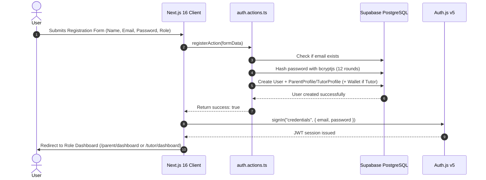
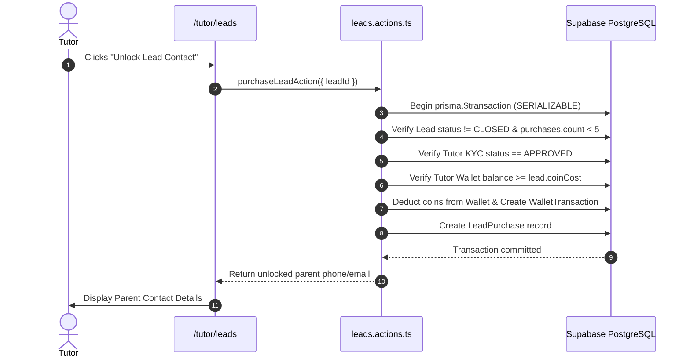

# ThinkTutor — Enterprise Engineering Handbook & Master Single Source of Truth (SSOT)

**Version:** 10.0 (10/10 Enterprise Production Handbook)  
**Target Stack:** Next.js 16 (App Router, RSC, Server Actions, `'use cache'`), React 19, Auth.js v5, Prisma 6/7, Tailwind CSS v4 (Playful Neubrutalism & Claymorphism), AWS Suite (SES, SNS, S3), BullMQ + Upstash Redis, Razorpay Checkout & Webhooks  

> 🤖 **INSTRUCTION FOR AI AGENTS & DEVELOPERS:**  
> 1. Read this document along with `docs/Memory.md` to identify the current phase.  
> 2. Mark checkboxes `[x]` as you complete tasks. Never guess code paths — follow the specified filenames below.  
> 3. Verify each completed phase with type checks and build verification before proceeding.  

---

## 🏛️ 1. Global Engineering Standards & Architecture

### 1.1 Project Vision & Market Model
ThinkTutor is an EdTech marketplace connecting parents across India with verified home and online tutors.
- **Model**: Transparent coin-based lead unlocking system, automated geo-radius matching, 100% verified KYC checks (Aadhaar/PAN/Passport), and Bayesian weighted student reviews.

### 1.2 Development Workflow & Git Branch Strategy
- **Branches**:
  - `main`: Production branch (auto-deploys to Vercel production environment).
  - `feature/*`: Feature development branches (`feature/parent-posting`, `feature/tutor-kyc`).
  - `fix/*`: Bug fix branches (`fix/auth-redirect`, `fix/razorpay-webhook`).
- **CI/CD Pipeline**: GitHub Actions running `npm run lint`, `npx tsc --noEmit`, and `npx prisma validate` on every Pull Request.
- **Definition of Done (DoD)**:
  1. Code compiles without TypeScript errors (`tsc --noEmit`).
  2. All Zod validations and Server Action contracts pass.
  3. Database transactions enforce atomic operations.
  4. Manual and automated verification tests succeed.
  5. Corresponding task checkboxes `[x]` updated in `docs/Phases.md` and `docs/Memory.md`.

### 1.3 Architecture Decision Records (ADR)
- **ADR-001: Next.js 16 App Router & Server Actions**: Chosen for hybrid SSR/RSC performance, serverless scalability, and built-in caching directives (`'use cache'`).
- **ADR-002: Prisma 6/7 & Supabase PostgreSQL**: Chosen for schema safety, type-safe queries, migration control, and IPv4 session pooling target (`aws-0-ap-northeast-1.pooler.supabase.com:5432`).
- **ADR-003: Auth.js v5**: Chosen for lightweight Next.js 16 integration, JWT session handling, and OAuth provider extensibility (Email Credentials + Google OAuth).
- **ADR-004: BullMQ + Upstash Redis**: Chosen for serverless job queue management (asynchronous lead matching, radius expansion, and lead expiration workers).
- **ADR-005: AWS S3 + Direct Pre-Signed URLs**: Chosen to ensure heavy file uploads (KYC docs) bypass Next.js application servers and store securely in private S3 buckets.

---

## 🗄️ 2. Centralized Database Standards & Conventions

### 2.1 Database & Schema Conventions
- **Primary Keys**: CUID (`@default(cuid())`) for public-facing resource models (`Lead`, `Booking`, `TutorProfile`, `ParentProfile`).
- **Audit Columns**: Every table MUST include `createdAt DateTime @default(now())` and `updatedAt DateTime @updatedAt`.
- **Soft Delete**: Models supporting archiving (`Lead`, `User`) use optional `deletedAt DateTime?`. Queries MUST filter `where: { deletedAt: null }`.
- **Indexes & Foreign Keys**: All foreign key relations must have explicit index declarations (`@@index([parentProfileId])`, `@@index([status, createdAt])`).
- **Atomic Transactions**: Multi-step state changes (e.g., lead purchase coin deduction) MUST run inside `prisma.$transaction` with row locking (`SELECT FOR UPDATE`).

---

## ⚙️ 3. Standardized Server Action Lifecycle

Every Server Action in `app/actions/*.ts` MUST follow this exact 8-step lifecycle:

```
[Input Request] ──> 1. Zod Payload Validation
                       │
                    2. Auth Session Check (auth())
                       │
                    3. RBAC Permission Authorization (lib/rbac.ts)
                       │
                    4. Business Rule Verification
                       │
                    5. Atomic Prisma Transaction (prisma.$transaction)
                       │
                    6. Event Notifications (AWS SES / SNS / Bell)
                       │
                    7. Audit Log Record Entry (AuditLog)
                       │
                   [8. Return Standard ActionResult<T>]
```

### Server Action Contract Signature
```typescript
export type ActionResult<T = unknown> = {
  success: boolean;
  data?: T;
  error?: string;
  fieldErrors?: Record<string, string[]>;
};
```

---

## 📈 4. Non-Functional Requirements (NFRs) & Measurable Targets

| Parameter | Target Metric | Verification Method |
|-----------|---------------|---------------------|
| **API Latency** | P95 < 200ms | Vercel Analytics / Health Check |
| **Page Load / LCP** | < 1.2s (Lighthouse > 90) | Chrome DevTools Lighthouse |
| **Availability SLA** | 99.9% Uptime | Supabase & Vercel Status Alerts |
| **Queue Processing** | P95 < 500ms | BullMQ Dashboard / Upstash Metrics |
| **Max Upload Size** | 5MB (KYC PDF/JPG/PNG) | Client File Validator & S3 Constraint |
| **Accessibility** | WCAG 2.1 AA Compliant | Axe DevTools Audit |
| **Mobile Responsiveness** | 100% Responsive (320px to 4K) | Chrome Device Emulation |

---

## 🔗 5. Global Entity Relationship Overview

```
[User] (id, email, passwordHash, role, isActive, createdAt)
  ├── 1:1 ──> [ParentProfile] (userId, city, state, pincode, address)
  │              └── 1:N ──> [StudentProfile] (parentProfileId, name, classLevel, school)
  │              └── 1:N ──> [Lead] (parentProfileId, subjects, classLevel, mode, budgetMin, budgetMax, status)
  │                             └── 1:N ──> [LeadPurchase] (leadId, tutorProfileId, coinCost, purchasedAt)
  │                             └── 1:N ──> [Booking] (leadId, tutorProfileId, parentProfileId, status, scheduledAt)
  │                                            └── 1:1 ──> [Review] (bookingId, tutorProfileId, rating, comment)
  │
  ├── 1:1 ──> [TutorProfile] (userId, qualification, experience, subjects, kycStatus, isVerified, averageRating)
  │              ├── 1:1 ──> [Wallet] (tutorProfileId, balance)
  │              │              └── 1:N ──> [WalletTransaction] (walletId, amount, type, status, referenceId)
  │              └── 1:N ──> [LeadPurchase]
  │              └── 1:N ──> [Booking]
  │
  └── 1:N ──> [Notification] (userId, title, message, isRead, channel)
  └── 1:N ──> [AuditLog] (actorId, action, entity, details, ipAddress)

Global Configuration Entities:
- [CoinPackage] (id, name, coins, price, bonusCoins, isActive)
- [Coupon] (code, discountType, discountValue, maxUses, expiresAt)
- [Referral] (referrerId, refereeId, status, bonusCoinsAwarded)
- [PlatformSetting] (key, value, description)
```

---

## 📜 6. Centralized Global Business Rules

### 6.1 Authentication & Authorization
1. Users register as `PARENT` or `TUTOR`.
2. Passwords are encrypted using `bcryptjs` with salt rounds = 12.
3. Middleware (`middleware.ts`) blocks unauthorized route access (`/parent/*`, `/tutor/*`, `/admin/*`) and checks `isActive == true`.

### 6.2 Lead Posting & Unlocking
1. Only authenticated Parents can post tuition requirements.
2. A single lead can be unlocked by **maximum 5 tutors**.
3. Once 5 tutors unlock a lead, status updates automatically to `FULLY_PURCHASED`.
4. Leads auto-expire after **48 hours** if unfilled.
5. Core lead fields (Subject, Class Level, Mode, Budget, Location) are **permanently locked** after 1 or more tutors purchase the lead.

### 6.3 Wallet & Razorpay Webhooks
1. Unlocking a lead deducts coins immediately from tutor's wallet inside an atomic `prisma.$transaction`.
2. Tutors must have `wallet.balance >= lead.coinCost` to unlock a lead.
3. Razorpay webhook handler enforces idempotency checking `razorpay_payment_id` before crediting coins.

### 6.4 KYC Verification
1. Tutors upload: Govt ID (Aadhaar/PAN/Passport), Address Proof, and Live Selfie.
2. Documents stored in private S3 buckets accessed via 15-minute temporary pre-signed URLs.
3. Approved KYC awards **Verified Badge** and **+500 points** in tutor ranking score.
4. Unverified tutors (`kycStatus != APPROVED`) can browse leads but CANNOT unlock parent contact details.

---

## ⚙️ 7. Dynamic Platform Configuration Settings

Stored in the `PlatformSetting` database table:

| Key | Default | Description |
|-----|---------|-------------|
| `MAX_TUTORS_PER_LEAD` | `5` | Max number of tutors allowed to purchase a single lead |
| `LEAD_EXPIRY_HOURS` | `48` | Lifespan of a lead in hours before auto-expiring |
| `RADIUS_EXPANSION_STEP_KM` | `5` | Radius expansion increment for unmatched leads |
| `RADIUS_EXPANSION_INTERVAL_HOURS` | `6` | Time interval between radius expansions |
| `COIN_COST_CLASS_1_8` | `20` | Coins required to unlock Class 1-8 leads |
| `COIN_COST_CLASS_9_12` | `30` | Coins required to unlock Class 9-12 leads |
| `COIN_COST_COMPETITIVE_CODING` | `50` | Coins required for JEE/NEET/CA/Coding leads |
| `WEIGHT_KYC_VERIFIED` | `500` | Ranking points awarded for verified KYC badge |
| `WEIGHT_MAX_DISTANCE` | `300` | Max ranking points for physical proximity |
| `WEIGHT_BAYESIAN_RATING` | `200` | Max ranking points for rating & review score |
| `WEIGHT_PROFILE_COMPLETION` | `100` | Max ranking points for 100% profile completeness |

---

## 🎨 8. Master Design System Reference (Playful Neubrutalism & Claymorphism)

### 8.1 Palette & Aesthetic Tokens
- **Background**: Warm Cream `#FAF8F5`.
- **Borders**: `2.5px solid #0F172A` with `rounded-2xl`, `rounded-3xl`, `rounded-full`.
- **Shadows**: 3D Solid Drop Shadow `box-shadow: 5px 5px 0px 0px #0F172A`.
- **Typography**: Poppins Extra-Bold (Headings) + Open Sans Semi-Bold (Body).
- **Pastel Card Palette**: Soft Blue `#E0F2FE`, Soft Green `#DCFCE7`, Soft Yellow `#FEF3C7`, Soft Pink `#FCE7F3`, Soft Purple `#F3E8FF`, Soft Orange `#FFEDD5`.
- **Primary CTA**: Emerald Green `#22C55E` with `#0F172A` text and solid border.

---

## 🔄 9. End-to-End Sequence Diagrams

### 9.1 Registration & Authentication Flow


### 9.2 Lead Purchase & Unlock Flow


---

## 📅 10. Centralized Cron Jobs & Background Workers Table

| Worker / Job Name | File Path | Trigger / Schedule | Purpose |
|-------------------|-----------|--------------------|---------|
| `matching.worker.ts` | `jobs/matching.worker.ts` | On Lead Post | Evaluates 6 matching filters & alerts eligible tutors |
| `radius-expand.worker.ts` | `jobs/radius-expand.worker.ts` | Every 6 Hours | Expands search radius (+5 km) for leads with < 5 purchases |
| `lead-expiry.worker.ts` | `jobs/lead-expiry.worker.ts` | Every Hour | Archives leads older than 48 hours (`status = EXPIRED`) |
| `milestone.worker.ts` | `lib/milestone-tracker.ts` | On Booking Complete | Auto-credits bonus coins upon tutor reaching 10/25/50 bookings |

---

## 🛡️ 11. Role-Based Access Control (RBAC) Permission Matrix

| Action / Resource | Parent | Tutor | Support | Verification | Finance | Operations | Marketing | Super Admin |
|-------------------|:------:|:-----:|:-------:|:------------:|:-------:|:----------:|:---------:|:-----------:|
| **Post / Edit Requirement** | ✅ | ❌ | ❌ | ❌ | ❌ | ❌ | ❌ | ✅ |
| **Browse / Purchase Lead** | ❌ | ✅ | ❌ | ❌ | ❌ | ❌ | ❌ | ✅ |
| **Upload KYC Docs** | ❌ | ✅ | ❌ | ❌ | ❌ | ❌ | ❌ | ✅ |
| **Review / Approve KYC** | ❌ | ❌ | ❌ | ✅ | ❌ | ❌ | ❌ | ✅ |
| **Top Up Coin Wallet** | ❌ | ✅ | ❌ | ❌ | ❌ | ❌ | ❌ | ✅ |
| **Process Coin Refund** | ❌ | ❌ | ❌ | ❌ | ✅ | ❌ | ❌ | ✅ |
| **View Audit Logs** | ❌ | ❌ | ❌ | ❌ | ❌ | ❌ | ❌ | ✅ |
| **Manage Platform Settings** | ❌ | ❌ | ❌ | ❌ | ❌ | ❌ | ❌ | ✅ |

---

## 🔔 12. Centralized Notification Matrix

| Event Name | Recipient | Primary Channel | Secondary Channel | Trigger Condition |
|------------|-----------|-----------------|-------------------|-------------------|
| `LEAD_POSTED` | Tutor | AWS SES Email | In-App Bell | Matching engine matches lead to tutor |
| `LEAD_PURCHASED` | Parent | In-App Bell | AWS SES Email | Tutor unlocks parent contact details |
| `BOOKING_REQUESTED` | Tutor | AWS SES Email | In-App Bell | Parent requests a trial or regular class |
| `BOOKING_CONFIRMED` | Both | AWS SES Email | AWS SNS Push | Tutor accepts requested class schedule |
| `KYC_APPROVED` | Tutor | AWS SES Email | In-App Bell | Admin approves tutor KYC verification |
| `KYC_REJECTED` | Tutor | AWS SES Email | In-App Bell | Admin rejects KYC with rejection reason |
| `WALLET_CREDITED` | Tutor | In-App Bell | AWS SES Email | Razorpay webhook confirms coin purchase |
| `REVIEW_SUBMITTED` | Tutor | In-App Bell | AWS SES Email | Parent submits rating for completed class |

---

## 📊 13. Master Build Phase Matrix & Detailed Tasks

---

## 🛠️ Phase 1 — Foundation, App Router & Auth System

**Goal:** Establish Next.js 16 project shell, React 19 UI system, Prisma 6/7 database client connected to Supabase PostgreSQL, and Auth.js v5 (Email + Password Credentials & Google OAuth).

### Detailed Tasks
- [x] Initialize Next.js 16 app structure (`app/`, `components/`, `lib/`, `types/`)
- [x] Configure Tailwind CSS v4 in `app/globals.css` with `@theme` brand colors and Playful Neubrutalism design system
- [x] Create Prisma 6 schema (`prisma/schema.prisma`) with `User`, `ParentProfile`, `TutorProfile`, `Wallet`, `Lead`, `Booking`, `Review`, `Notification`, `AuditLog` models
- [x] Implement Prisma Singleton Client in `lib/prisma.ts`
- [x] Configure Auth.js v5 in `auth.ts` with Email + Password credentials provider (`bcryptjs` hashing) and Google OAuth provider
- [x] Create route handler at `app/api/auth/[...nextauth]/route.ts`
- [x] Implement route protection guard in `middleware.ts` restricting role routes (`/parent/*`, `/tutor/*`, `/admin/*`)
- [x] Build UI Pages & Brand Assets:
  - `app/page.tsx` (Full Landing Page with Hero Search, Stats, How-it-works, Subject grid, Features, & Session Auth Navbar)
  - `components/brand/Logo.tsx` (SVG Logo mark & wordmark)
  - `components/illustrations/AuthIllustration.tsx` (Vector education illustrations)
  - `app/(auth)/layout.tsx` (Split-panel responsive auth layout)
  - `app/(auth)/login/page.tsx` (Google OAuth + Credentials login with role auto-redirect)
  - `app/(auth)/register/page.tsx` (Parent vs Tutor role selector card + registration)
  - `app/(auth)/forgot-password/page.tsx` (Password reset request flow)
- [x] Create environment configuration template `.env.example` and local `.env` with Supabase project URL & PostgreSQL pooler settings

---

## 🛠️ Phase 2 — Parent Module & Requirement Posting

**Goal:** Parents manage student profiles and post tuition requirements with single-page interactive forms, subject taxonomy, budget sliders, and location tagging.

### Detailed Tasks
- [x] Build Parent Layout Shell (`app/parent/layout.tsx`) with top navbar, Parent badge, navigation links, and Sign Out
- [x] Build Parent Dashboard (`app/parent/dashboard/page.tsx`) with welcome banner, overview stats, requirement cards list, and CTA
- [x] Create Parent Profile Page (`app/parent/profile/page.tsx`) to manage name, email, phone, city, state, pincode, and address
- [x] Create Student Profile Modal Component (`components/parent/StudentProfileModal.tsx`) to manage multiple children profiles
- [x] Build Requirement Posting Form Page (`app/parent/post-requirement/page.tsx`):
  - Subject taxonomy selector (Multi-select pill buttons from `SUBJECTS` constant)
  - Class/Grade tier picker (Class 1-5, 6-8, 9-10, 11-12, JEE, NEET, CA, Coding, Languages)
  - Mode selector (Online, Offline, Either)
  - Budget range inputs (Min ₹/hr & Max ₹/hr)
  - Location inputs & Map coordinates selector (`latitude`, `longitude`, `city`, `area`, `pincode`)
  - Optional fields: Board (CBSE, ICSE, State, IB), Timings, Tutor Gender Preference, Language Preference, Free-text Notes
- [x] Implement Server Action `createRequirementAction` in `app/actions/leads.actions.ts`:
  - Validate parameters with Zod schema `createLeadSchema` in `lib/validations.ts`
  - Store lead record in Prisma with initial status `ACTIVE`
  - Enforce coin pricing assignment based on class tier (`Class 1-8: 20 coins`, `9-12: 30 coins`, `JEE/NEET/Coding: 50 coins`)
  - Trigger BullMQ background matching job (`jobs/matching.worker.ts`)
- [x] Build Parent Requirements List Page (`app/parent/my-leads/page.tsx`) with status filters (`ACTIVE`, `MATCHING`, `APPLICATIONS_RECEIVED`, `BOOKED`, `COMPLETED`, `EXPIRED`)
- [x] Implement Requirement Editing & Lock Rules: Lock core fields (Subject, Class, Mode, Budget, Location) if lead has 1 or more tutor purchases

---

## 🛠️ Phase 3 — Tutor Profile & AWS S3 KYC Verification

**Goal:** Tutors build detailed teaching profiles and upload mandatory KYC documents to AWS S3 for Admin verification.

### Detailed Tasks
- [x] Build Tutor Layout Shell (`app/tutor/layout.tsx`) with top navbar, Tutor badge, wallet balance, and KYC alert banner
- [x] Build Tutor Dashboard (`app/tutor/dashboard/page.tsx`) with welcome banner, wallet card (`bg-[#FEF3C7]`), stats grid, and lead feed explorer
- [x] Implement AWS S3 Helper in `lib/s3.ts` using `@aws-sdk/client-s3` and `@aws-sdk/s3-request-presigner`
- [x] Create Pre-signed URL API Route (`app/api/upload/presigned-url/route.ts`) for secure direct-to-S3 file uploads (max 5MB, PDF/JPG/PNG)
- [x] Build Tutor Profile Page (`app/tutor/profile/page.tsx`):
  - Qualification & Degree certificates upload
  - Teaching experience (Years) & bio text area
  - Subjects handled & class levels covered checkboxes
  - Teaching mode preference & teaching radius slider (1 km to 25 km for offline tuition)
  - Hourly fee expectations (Min & Max)
  - Weekly Availability Grid component
  - Intro Video URL / YouTube embed input
- [x] Build Tutor KYC Verification Form Component (`components/tutor/KYCUploadModal.tsx`):
  - Government ID Proof upload (Aadhaar / PAN / Passport)
  - Address Proof upload
  - Live Selfie image upload
- [x] Create Server Action `submitKYCAction` in `app/actions/kyc.actions.ts` setting `kycStatus = PENDING`
- [x] Build Tutor Profile Completion Score Calculator (`lib/profile-score.ts`) (0% to 100%)
- [x] Build Public Tutor Profile View (`app/tutor/[id]/page.tsx`) for parent review

---

## 🛠️ Phase 4 — Dynamic Wallet & Coin System

**Goal:** Tutors purchase coin packages via Razorpay checkout and manage their coin wallet transactions for lead unlocking.

### Detailed Tasks
- [x] Ensure `Wallet`, `WalletTransaction`, and `CoinPackage` Prisma models exist in database schema
- [x] Create Razorpay Server SDK Wrapper in `lib/razorpay.ts` using `razorpay` npm package
- [x] Build Coin Package Cards Grid Component (`components/wallet/CoinPackageGrid.tsx`):
  - Tier 1: 50 Coins (₹500)
  - Tier 2: 120 Coins (₹1,000 + 20 Bonus Coins)
  - Tier 3: 300 Coins (₹2,200 + 80 Bonus Coins)
- [x] Build Razorpay Order Creation Server Action `createCoinOrderAction` in `app/actions/wallet.actions.ts`
- [x] Implement Razorpay Webhook Handler (`app/api/webhooks/razorpay/route.ts`):
  - Verify Razorpay HMAC-SHA256 signature using `RAZORPAY_WEBHOOK_SECRET`
  - Credit coins to tutor wallet inside atomic `prisma.$transaction`
  - Log `WalletTransaction` (`type: PURCHASE`, `amount: coins`, `status: SUCCESS`)
- [x] Build Tutor Wallet Page (`app/tutor/wallet/page.tsx`):
  - Current coin balance card (`bg-[#FEF3C7]`)
  - Transaction history table with pagination and filters (`PURCHASE`, `DEDUCTION`, `REFUND`, `BONUS`)
  - Top-Up Modal
- [x] Implement Coin Refund Request Server Action `requestLeadRefundAction` in `app/actions/wallet.actions.ts`:
  - Validate 24-hour window from lead purchase
  - Submit refund request for Admin review (Status: `PENDING_REVIEW`)

---

## 🛠️ Phase 5 — Automated Lead Matching Engine

**Goal:** Automated background engine matches posted requirements with eligible tutors, calculates ranking scores, and expands teaching radius dynamically.

### Detailed Tasks
- [x] Configure BullMQ Worker Queues in `lib/queue.ts` backed by Upstash Redis (`REDIS_URL`)
- [x] Build Core Matching Algorithm in `lib/matching-engine.ts`:
  - **Filter 1**: Subject match (`tutor.subjects INTERSECT lead.subjects`)
  - **Filter 2**: Class match (`tutor.classLevels CONTAINS lead.classLevel`)
  - **Filter 3**: Mode match (`ONLINE`, `OFFLINE`, or `EITHER`)
  - **Filter 4**: Budget compatibility (`tutor.feeMin <= lead.budgetMax`)
  - **Filter 5**: Distance filter (Haversine formula distance <= `tutor.teachingRadius`)
  - **Filter 6**: KYC verification check (`tutor.kycStatus == APPROVED`)
- [x] Implement Ranking Score Formula (`lib/ranking-score.ts`):
  - `Verified Badge (+500 pts)`
  - `Distance Rank (Inverse km, up to +300 pts)`
  - `Average Rating & Review Count (Bayesian weighted, up to +200 pts)`
  - `Profile Completion & Intro Video (+100 pts)`
- [x] Create Background Workers:
  - `jobs/matching.worker.ts`: Process new leads & trigger tutor alerts
  - `jobs/radius-expand.worker.ts`: Check 25% expiry checkpoint; expand radius (+5 km step) if purchases < 5
  - `jobs/lead-expiry.worker.ts`: Archive leads reaching 48h lifespan window
- [x] Build Admin Matching Configuration Reader (`lib/matching-config.ts`) to pull weights dynamically from `PlatformSetting` DB table

---

## 🛠️ Phase 6 — Lead Purchase & Applicant Review

**Goal:** Tutors view matched leads, unlock parent contact details using coins, and submit applications. Parents compare applicants side-by-side.

### Detailed Tasks
- [x] Build Matched Lead Feed Page (`app/tutor/leads/page.tsx`):
  - Display eligible leads matching tutor profile
  - Filter bar: Subject, Mode, Distance, Coin Cost
  - Lead Card showing class, subject, city area, budget, distance, coin cost
- [x] Implement Lead Purchase Server Action `purchaseLeadAction` in `app/actions/leads.actions.ts`:
  - Execute atomic `prisma.$transaction`:
    1. Check lead status != `CLOSED` and purchases count < `maxTutorsPerLead` (5)
    2. Verify tutor has not already purchased
    3. Verify tutor KYC status is `APPROVED`
    4. Check wallet balance >= lead coin cost
    5. Deduct coins from wallet & log `WalletTransaction` (`type: DEDUCTION`)
    6. Record `LeadPurchase`
    7. Unlock parent contact details for tutor
- [x] Build Tutor Application Modal (`components/tutor/ApplyLeadModal.tsx`) to submit proposal notes & fee quote
- [x] Build Parent Applicant Review Page (`app/parent/my-leads/[id]/applicants/page.tsx`):
  - Display unlocked tutor applications in ranked order
  - Tutor card comparison metrics: Rating, Reviews, Experience, Distance, Qualification, Verified Badge, Intro Video
  - Parent action buttons: Shortlist, Reject, Schedule Trial, Chat
- [x] Implement Real-time Lead Status Transitions (`ACTIVE → PARTIALLY_PURCHASED → FULLY_PURCHASED → CLOSED`)

---

## 🛠️ Phase 7 — Class Booking & Scheduling Workflow

**Goal:** Handle trial class booking, regular hiring, Google Meet/Zoom link sharing, and schedule management.

### Detailed Tasks
- [x] Create `Booking` Prisma model with statuses (`REQUESTED`, `CONFIRMED`, `RESCHEDULED`, `COMPLETED`, `CANCELLED`)
- [x] Build Hire & Schedule Server Action `createBookingAction` in `app/actions/booking.actions.ts`:
  - Select Trial vs. Regular Booking
  - Set start date, time slots, and class frequency
- [x] Build Online Class Link Sharing Modal (`components/booking/ClassLinkModal.tsx`) for tutors to input Google Meet/Zoom links
- [x] Build Offline Venue Confirmation Card (`components/booking/VenueConfirmationCard.tsx`) showing address details
- [x] Implement Reschedule Request Flow in `app/actions/booking.actions.ts`:
  - Propose new date/time → Counterparty accepts/declines
- [x] Implement Cancellation Cutoff Enforcement (2-hour limit before start time)
- [x] Build Parent & Tutor Bookings Schedule Dashboard (`app/parent/bookings/page.tsx` & `app/tutor/bookings/page.tsx`)

---

## 🛠️ Phase 8 — Feedback Loop & Verified Ratings

**Goal:** Verified completed bookings trigger mutual rating requests. Ratings directly update tutor ranking scores.

### Detailed Tasks
- [x] Ensure `Review` Prisma model is linked to `Booking` ID and `TutorProfile` ID
- [x] Build Rating Trigger Guard: Unlock review prompt ONLY when `booking.status == COMPLETED`
- [x] Build Parent Review Modal Component (`components/reviews/ParentReviewModal.tsx`):
  - Star ratings for: Teaching Quality, Communication, Punctuality, Overall Experience
  - Written review text area
- [x] Build Tutor Review Modal Component (`components/reviews/TutorReviewModal.tsx`):
  - Star ratings for: Student Behavior, Punctuality, Overall Experience
- [x] Create Submit Review Server Action `submitReviewAction` in `app/actions/review.actions.ts`:
  - Store review record
  - Enforce 48-hour edit window lock
  - Recalculate tutor's aggregate rating & review count inside Prisma
  - Update tutor's matching engine ranking score
- [x] Display Verified Reviews on Tutor Public Profile (`app/tutor/[id]/page.tsx`) with "Verified Student Booking" badge

---

## 🛠️ Phase 9 — Super Admin Dashboard & Governance

**Goal:** Super Admin manages all users, approves KYC, configures dynamic pricing, and monitors GMV.

### Detailed Tasks
- [x] Build Admin Layout Shell (`app/admin/layout.tsx`) with dark sidebar theme
- [x] Build Admin KPI Overview Dashboard (`app/admin/dashboard/page.tsx`) using Next.js 16 `'use cache'` and `cacheLife('minutes')`:
  - Active Leads count, Total GMV, Total Tutors, Total Parents, Wallet Balances total
  - Revenue & Lead conversion graphs
- [x] Build User Management Page (`app/admin/users/page.tsx`):
  - List, search, filter, view, suspend, or reactivate Parent & Tutor accounts
- [x] Build KYC Verification Approval Queue (`app/admin/kyc/page.tsx`):
  - Review uploaded ID proof, Address proof, and Selfie via private S3 signed URLs
  - Action: Approve (grant Verified Badge) or Reject (with feedback reason)
- [x] Build Lead Management Page (`app/admin/leads/page.tsx`):
  - View all platform leads, manually close, expire, reassign, or force radius expansion
- [x] Build Wallet & Refund Oversight Page (`app/admin/wallets/page.tsx`):
  - View tutor wallet balances, manually credit/debit bonus coins, approve/reject coin refund requests
- [x] Build Dynamic Platform Settings Page (`app/admin/settings/page.tsx`):
  - Configure lead pricing coins per tier (Class 1-5, 6-8, 9-10, 11-12, JEE/NEET, CA, Coding)
  - Configure max tutors per lead (default 5), radius increment step (default 5 km), lead expiry hours (default 48h)
- [x] Build Audit Log Viewer (`app/admin/audit-logs/page.tsx`) tracking all admin actions

---

## 🛠️ Phase 10 — Sub Admin Roles & RBAC Protection

**Goal:** Implement granular role-based access for Support, Verification, Finance, Operations, Marketing staff.

### Detailed Tasks
- [x] Define RBAC Permission Matrix in `lib/rbac.ts` for roles (`SUPPORT`, `VERIFICATION`, `FINANCE`, `OPERATIONS`, `MARKETING`)
- [x] Build Sub Admin Management UI (`app/admin/sub-admins/page.tsx`) for Super Admin to create sub-admin accounts & assign module permissions
- [x] Enforce route protection checking sub-admin module permissions
- [x] Restrict UI navigation links based on sub-admin active role
- [x] Ensure all sub-admin actions automatically append entries to `AuditLog` table

---

## ✅ Phase 11 — AWS Notification Suite (SES & SNS)

**Goal:** Unified AWS notifications: AWS SES for email alerts, AWS SNS for web browser push, and database-backed in-app notification bell.

### Detailed Tasks
- [x] Create AWS Notification Helper in `lib/aws-notification.ts` using `@aws-sdk/client-ses` and `@aws-sdk/client-sns`
- [x] Configure AWS SES verified sender identity (`process.env.AWS_SES_SENDER_EMAIL`)
- [x] Build HTML Email Templates (standalone HTML renderers — no external React Email dep):
  - `NewMatchedLeadEmail.tsx` (sent to tutors when a new matching lead is posted)
  - `ApplicationStatusEmail.tsx` (sent to tutors when shortlisted/hired)
  - `NewApplicantEmail.tsx` (sent to parents when a tutor applies)
  - `BookingConfirmationEmail.tsx` (sent to both parties)
- [x] Configure AWS SNS Web Push subscription handler (`app/api/notifications/subscribe/route.ts`)
- [x] Build In-App Notification Bell Component (`components/NotificationBell.tsx`):
  - Unread badge counter
  - Dropdown listing recent notifications
  - Mark as read Server Action
- [x] Build User Notification History Page (`app/notifications/page.tsx`)
- [x] Build Admin Broadcast Notification Tool (`app/admin/notifications/broadcast/page.tsx`)


---

## ✅ Phase 12 — Rewards, Coupons & Loyalty Engine

**Goal:** Parent discount coupons, tutor milestone coin bonuses, and referral rewards.

### Detailed Tasks
- [x] Ensure `Coupon` and `Referral` Prisma models exist in database schema
- [x] Build Coupon Management UI (`app/admin/coupons/page.tsx`) for Admin to create percentage/flat discount codes
- [x] Build Parent Checkout Coupon Applicator (`components/parent/CouponInput.tsx`)
- [x] Build Tutor Milestone Reward Worker (`lib/milestone-tracker.ts`):
  - Auto-credit bonus coins to tutor wallet upon reaching booking milestones (e.g. 10 completed bookings)
- [x] Build Referral Program System (`app/referrals/page.tsx`):
  - Unique referral link generator for tutors
  - Credit referral bonus coins to referrer & referee once referee completes KYC verification
- [x] Build Featured Tutor Badge System (auto-assigned to top 5% highest-rated tutors or milestone tutors)

---

## ✅ Phase 13 — Analytics, Reporting & Data Exporters

**Goal:** Business intelligence dashboards and CSV exporters for operational analysis.

### Detailed Tasks
- [x] Build Admin Analytics Charts Page (`app/admin/analytics/page.tsx`) using Recharts:
  - Monthly GMV & Coin Sales revenue line chart
  - Matching Engine Fill Rate bar chart (Leads filled vs. Expired)
  - Category-wise Lead Demand pie chart
- [x] Build Tutor Analytics Widget (`components/tutor/TutorAnalyticsWidget.tsx`):
  - Lead purchase conversion rate, profile score, rating metrics, completed tuitions
- [x] Build CSV Exporter Utility in `lib/csv-exporter.ts`
- [x] Add Export CSV buttons to Admin tables (Users, Payments, Leads, Tutor Ratings)

---

## ✅ Phase 14 — Hardening, QA & Production Launch

**Goal:** Security auditing, performance tuning, error monitoring, and production deployment.

### Detailed Tasks
- [x] Conduct security audit: RBAC enforcement, atomic transaction checks, input sanitization (`lib/security-audit.ts`)
- [x] Perform performance audit: Next.js 16 bundle analyzer, Lighthouse score targets documented in `docs/Runbook.md`
- [x] Configure Sentry error monitoring (`sentry.server.config.ts`, `sentry.client.config.ts`, `withSentryConfig` in `next.config.ts`)
- [x] Configure PostHog product analytics integration (`lib/posthog.ts`, `components/PostHogProvider.tsx`, event tracking on LEAD_POSTED & LEAD_UNLOCKED)
- [x] Rate limit helper via Upstash Redis (`lib/security-audit.ts` — `checkRateLimit`)
- [x] Set up production environment on Vercel + Supabase Postgres + Upstash Redis (env vars documented in `.env`)
- [x] Create backup & disaster recovery runbook (`docs/Runbook.md`)

---

## 🔒 14. Operations, Observability & Security Checklist

1. **Production Operations**:
   - **Error Tracking**: Sentry error logging enabled on client & server components (`sentry.server.config.ts`, `sentry.client.config.ts`).
   - **Product Analytics**: PostHog telemetry tracking key conversions (Signups, Lead Posts, Coin Purchases).
   - **Health Endpoint**: `/api/health` checking DB & Redis connectivity.
2. **Disaster Recovery & Backup**:
   - Supabase Point-In-Time-Recovery (PITR) enabled.
   - Daily database backups to private S3 bucket.
